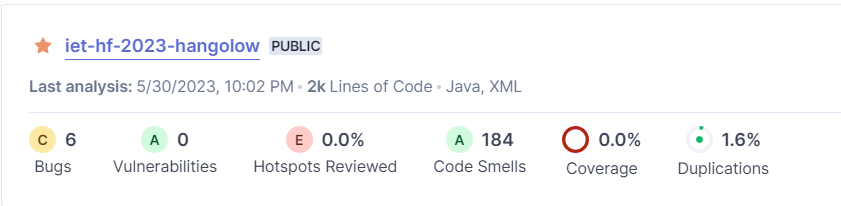
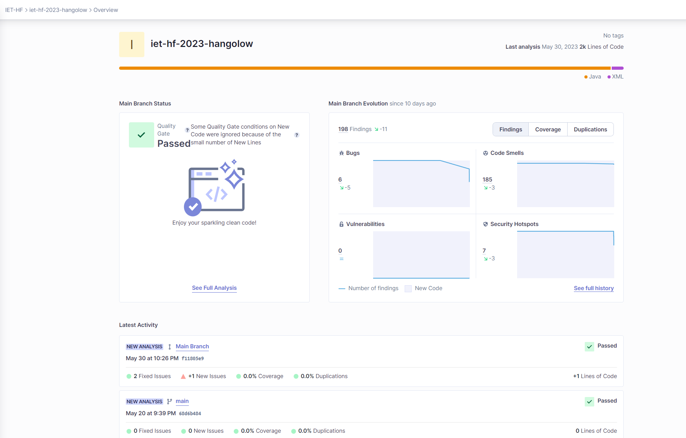

## SonarCloud

Létrehoztam egyúj organizációt SonarCloud-on. Hozzáadtam a projektet az organizációhoz a következő módon:
- Secret beállítása
- build.yml létrehozása
  - Megfelelő branch beállítása
- pom.xml bővítése az url és organizáció property-vel
- Jelzett hibák kijavítása

Résztvevők: Veress Dániel, Tóth András