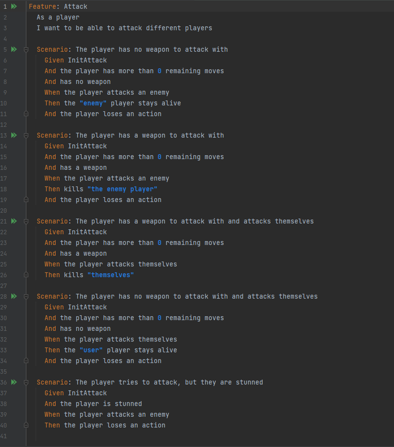

# BDD tesztek
Résztvevők: Szász Erik + Kiss Bence

### Elvégzett munka:

Először a BDD tesztek követéséhez létrehoztunk egy Cucumber Studio projektet, azonban ez a későbbiek során feleslegesnek bizonyult.
Az általunk használt IDE-ben (IntelliJ), mindenféle nehézség nélkül tudtunk BDD teszteket írni, azok eredményeit nyomon követni, illetve kollaborálni egymással a jobb tesztelés érdekében.

Az elvégzett munka lépései:
1. A BDD tesztek működésének elemzése.
2. Cucumber, illetve a "Gherkin" nyelv megismerése.
3. A teszt projekt felállítása.
4. Teszt esetek összeállítása.
5. Feature-ök definiálása.
6. A Feature-ökhöz tartozó lehetséges Scenario-k megadása.
7. A Scenario-k írása közben használt lépések definiálása és a hozzájuk tartozó kód megírása.
8. Utóbbihoz szükség keretrendszer felállítása.

### Összefoglalás

A BDD tesztek és a Unit tesztek közötti különbség megértése nehézséget okozott az elején.
Emellett nem volt egyértelmű, milyen keretrendszert kellene használnunk a BDD tesztek létrehozásához, futtatásához.
Ezért a projekt elején felesleges időt fordítottunk a CucumberStudio beüzemelésére.

Miután ezeket a nehézségeket túlléptük, elkezdtük definiálni a teszteseteket.
Ebből jó sok volt, azonban a Gherkin nyelvet használva könnyen tudtuk létrehozni azokat.
A stepek megírása sok időt vett igénybe és néha nem az elvártak szerint működtek.

Összességében hasznosnak bizonyult a BDD tesztek implementálása a projektünkbe, sok működésbeli hibát vettünk észre utólag emiatt.
Ezeket dokumentáltuk, hogy a későbbiek során javítani lehessen őket.

