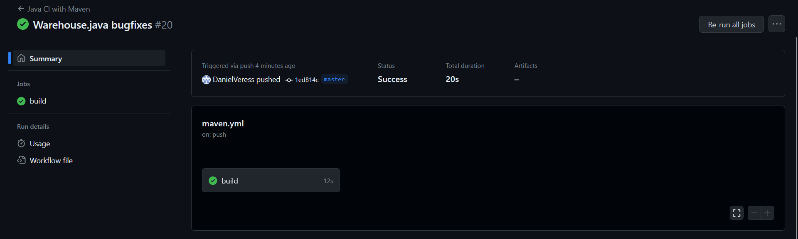
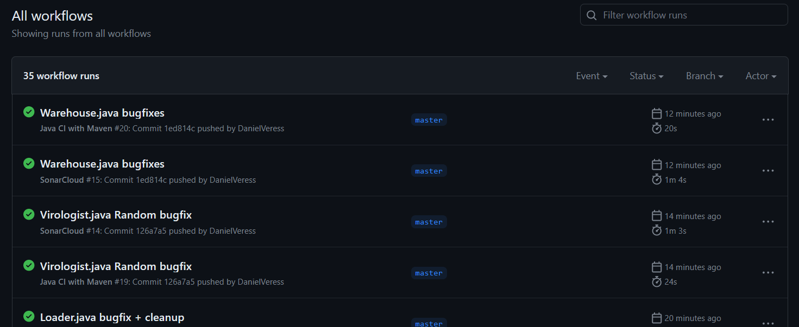

# Build keretrendszer beüzemelése
Résztvevők: Tóth András + Veress Dániel

### Elvégzett munka:

1. Maven felállítása 
   
    - a maven-nel való build-elés megcsinálása

2. GitHub Actions beüzemelése

    - mind új commit esetén lefut a maven, így látható, hogy a kód build-elhető vagy sem

### Összefoglalás

Összességében elég egyszerű volt a keretrendszer felállítása, de azért figyelni kellett a branchtől kezdve sok minden másra is, így néha a legkisebb elírás is sok időveszteséggel járt.

