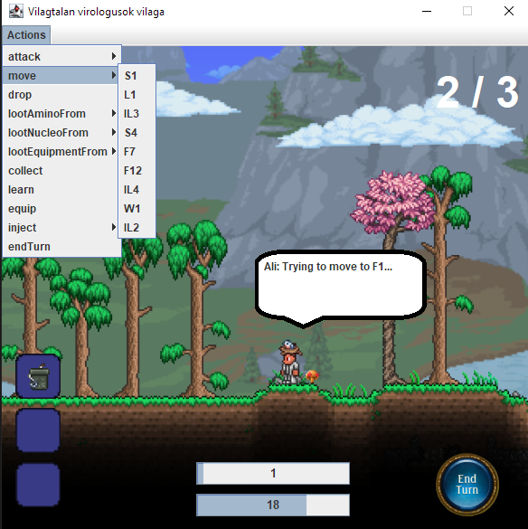

# Manuális tesztek
Résztvevők: Szász Erik + Kiss Bence

### Elvégzett munka:

1. A dokumentációban szereplő lehetséges use-case-ek és saját tapasztalatunk alapján definiáltuk a teszteseteket és a várt viselkedést.
2. Jelentős időt töltöttünk a játék kipróbálásával, funkcióinak megismerésével.
3. Ezek után közösen átmentünk a különböző teszteken és próbáltunk az elvárt működéssel nem megegyező eseteket találni.
4. Emellett próbáltuk értékelni a játék használhatóságát és felhasználói élményét.
5. Az utóbbival kapcsolatos észrevételeinket a tesztek eredményei mellé felírtuk.

### Összefoglalás

A manuális tesztesetek, illetve hogy miket kéne igazából figyelembe venni nem volt annyira egyértelmű.
Azonban miután elkezdtük a programot felhasználóként is használni, körvonalazódtak a teendők.
A tesztelési folyamat közben több viselkedésbeli hiba is előjött. Ezeket lehetőségünk szerint dokumentáltuk, hogy a későbbiek során javítani tudjuk azokat.

Azonban a legszembetűnőbb hibák, amelyeket találtunk a program felhasználói élményével kapcsolatosak.
Ez rávilágított arra, hogy mennyire fontos egy felhasználóbarát UI készítése a hasonló fajta alkalmazásoknál

