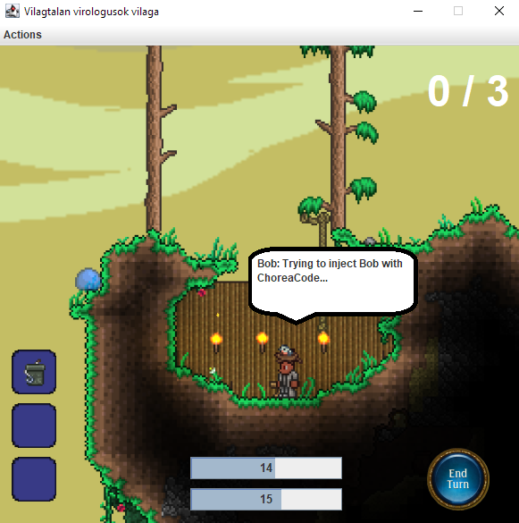

# Agent manual test results

## Agents

Agents can be crafted after learning the corresponding Genetic Code.
This is exactly as outlined in the specification.

When crafting agents, the resources do go down.
It is worth noting that crafting as such does not exist.
The agents are only created when trying to inject players. After this, they are used immediately used.
There is no way to store agents in the inventory.

There is no feedback regarding lack of resources when trying to craft an agent.

The agents works as expected, no problems were found.

When equiped with a glove, the player successfully throws back the agent to the attacker.

Also the cloak can resist the effects of the agents.