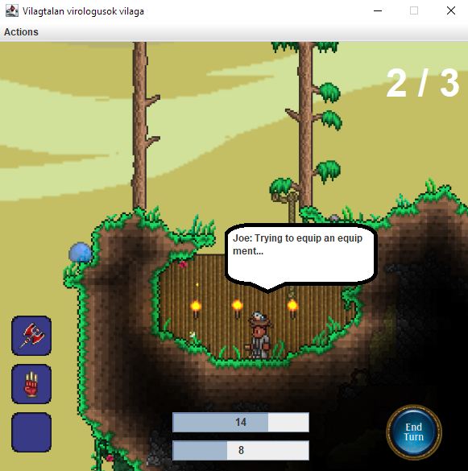

# Field operation manual test results

## Common
It is not clear if field specific actions can be executed.
Also, the results of such actions are not well presented.

Every field (except the basic field type) allows the player to do their corresponding special action, as outlined in the specification.

## Learn
Learning works, but there is no clear indication of what type of genetic code we could learn from the field.
This results in the user not being sure about the failure of the learn action, when trying to learn a genetic code that they already know.

## Drop
Droppins works as expected.

## Equip
Picking up equipment works flawlessly. The response is quick and obvious.

It is not apparent, if the current field contain an equipment or not.
If the inventory is full, the equiment is not picked up.

## Collect 
Collect seems to work as intended.
Moving to a warehouse and starting the collect action increases the number of resources in the player's inventory.
It should be noted, that the type of resource collected seems to be random.
 