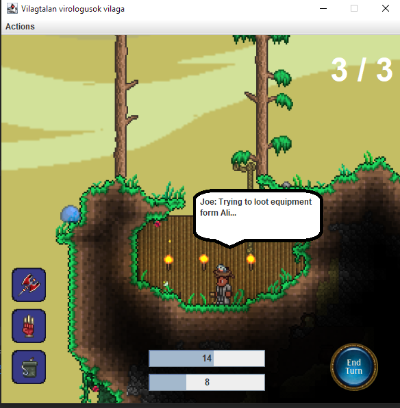
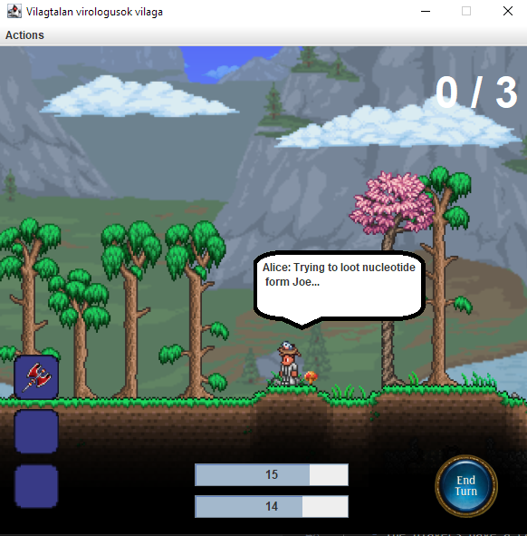

# Steal manual test results

## Steal
As expected, while players can initiate the steal action, they are unable to steal from the enemy if they are not stunned.
This results in them losing an action point normally.
There is an issue where the action point is not reducted if the inventory is full. This is only true for trying to loot an equipment from the enemy players.

Stealing works when the enemy player is stunned.

As we can see, the Nucleo count went up by one from the initial value.