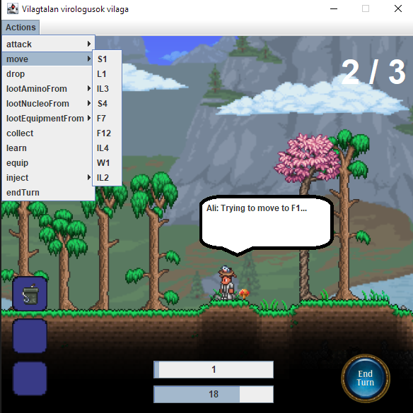

# View manual test results

## Graphical interface
The graphical interface is well developed, but it is lacking in certain aspects.

Certain actions and outcomes are not obvious.
Problems we found:
- It is difficult to differentiate between players
- It is difficult to differentiate between the players' turns
- It is difficult to differentiate between fields

The UI elements are not explained well and they are not obvious.	
For a new player, figuring out the meaning behind the two numbers in the lower bars might be challenging.

Same goes for the equipments. While the icons are nice, there is no explanation about them.
No text is shown when hovering over the items. It may inconvenience the visually impaired.

Eventhough there is feedback about the actions performed, the results of them are missing.
Sometimes it is hard to figure out the consequences.
For example, when moving to a different field of the same type or when attacking players.

The UI is responsive, there is no freezing while playing the game.

It is clear what actions the user can take.
Formatting is not up to standards.
